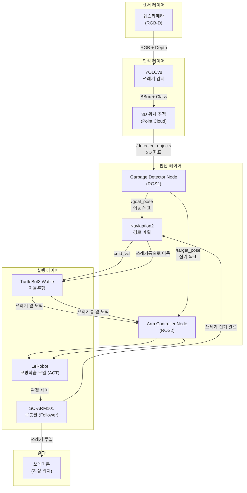
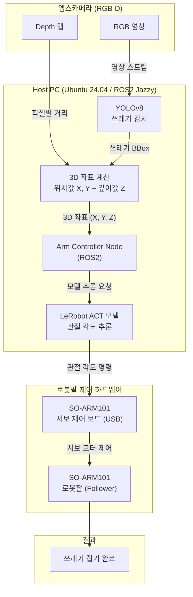
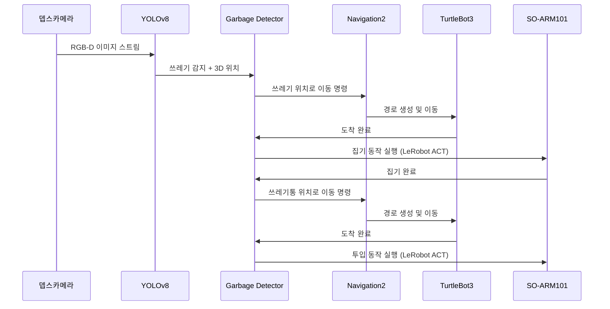

# SO-ARM101 자율 쓰레기 수거 로봇 캡스톤 프로젝트

> ROS2 + SO-ARM101 로봇팔을 활용한 자율 쓰레기 수거 시스템

---

## 전체 시스템 블럭도 (2학기 최종)

---

## 1학기 블럭도

---

## 전체 동작 흐름

---

## 기술 스택

| 구분 | 기술 |
|------|------|
| OS | Ubuntu 24.04 |
| 로봇 미들웨어 | ROS2 Jazzy |
| 자율주행 | TurtleBot3 Waffle + Navigation2 |
| 로봇팔 | SO-ARM101 (Leader/Follower) |
| 학습 프레임워크 | LeRobot (Hugging Face) - ACT |
| 물체 인식 | YOLOv8 + RGB-D 카메라 |
| 언어 | Python, C++ |

---

## 개발 로드맵

### 1학기 - 로봇팔 위주
- [ ] 개발 환경 구축 (ROS2 Jazzy + LeRobot)
- [ ] SO-ARM101 캘리브레이션 및 기초 제어
- [ ] ROS2 노드로 팔 제어 래핑
- [ ] 뎁스카메라 연동 및 3D 위치 추정
- [ ] 쓰레기 집기 데이터 수집 (텔레오퍼레이션)
- [ ] ACT 모델 학습 및 검증

### 2학기 - 전체 통합
- [ ] TurtleBot3 자율주행 연동
- [ ] 전체 파이프라인 통합 테스트
- [ ] 성능 최적화 및 시연
