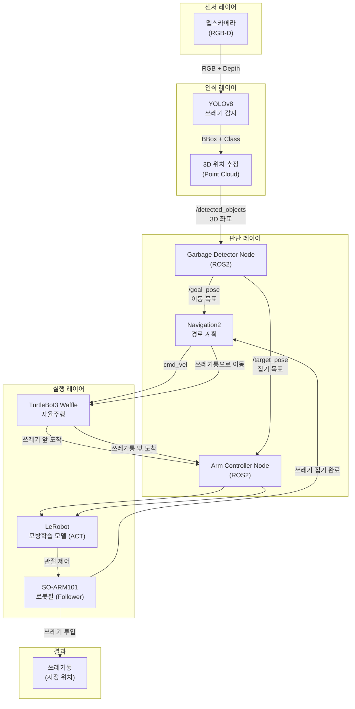
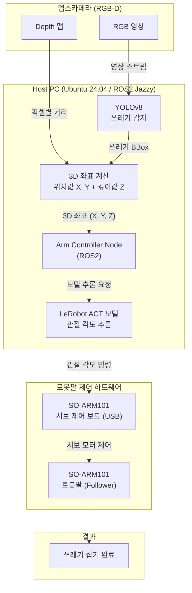
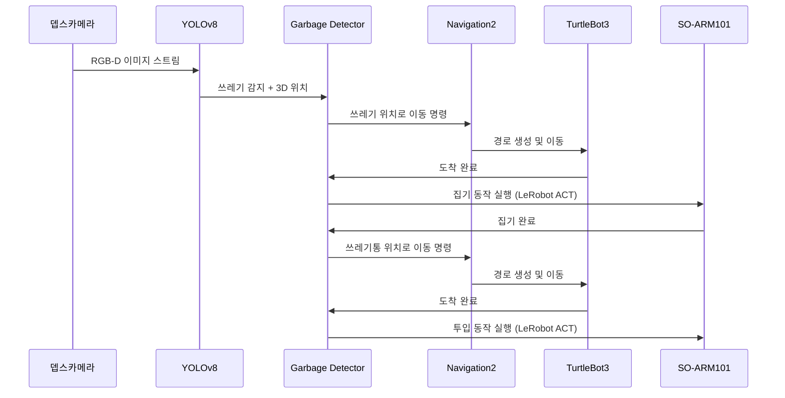

# SO-ARM101 자율 쓰레기 수거 로봇 캡스톤 프로젝트

> ROS2 + SO-ARM101 로봇팔을 활용한 자율 쓰레기 수거 시스템

---

## 개발 목적

현대 도시에서는 쓰레기 관리 문제가 계속 증가하고 있습니다. 특히 공원, 캠퍼스와 같은 넓은 공간에서는 사람이 직접 쓰레기를 찾고 수거하는 데 많은 시간과 인력이 필요합니다. 따라서 카메라와 인공지능을 이용해 쓰레기를 자동으로 탐지하고 로봇이 이동하여 수거하도록 하는 시스템을 만드는 것이 목적입니다.

---

## 전체 시스템 블럭도 (2학기 최종)



---

## 1학기 블럭도



---

## 전체 동작 흐름



---

## 기술 스택

| 구분 | 기술 |
|------|------|
| OS | Ubuntu 24.04 |
| 로봇 미들웨어 | ROS2 Jazzy |
| 자율주행 | TurtleBot3 Waffle + Navigation2 |
| 로봇팔 | SO-ARM101 (Leader/Follower) |
| 학습 프레임워크 | LeRobot (Hugging Face) - ACT |
| 물체 인식 | YOLOv8 + RGB-D 카메라 |
| 언어 | Python, C++ |

---

## 개발 로드맵

### 1학기 - 로봇팔 위주
- [ ] 개발 환경 구축 (ROS2 Jazzy + LeRobot)
- [ ] SO-ARM101 캘리브레이션 및 기초 제어
- [ ] ROS2 노드로 팔 제어 래핑
- [ ] 뎁스카메라 연동 및 3D 위치 추정
- [ ] 쓰레기 집기 데이터 수집 (텔레오퍼레이션)
- [ ] ACT 모델 학습 및 검증

### 2학기 - 전체 통합
- [ ] TurtleBot3 자율주행 연동
- [ ] 전체 파이프라인 통합 테스트
- [ ] 성능 최적화 및 시연

---

## 개발 환경 세팅

### 사전 요구사항

- Ubuntu 24.04
- Python 3.10+
- GPU (CUDA 지원 권장)
- SO-ARM101 전체 키트 (Leader + Follower)

---

### 1. Miniconda 설치

```bash
wget https://repo.anaconda.com/miniconda/Miniconda3-latest-Linux-x86_64.sh
bash Miniconda3-latest-Linux-x86_64.sh
source ~/.bashrc
```

---

### 2. LeRobot 설치

#### 2-1. 가상환경 생성

```bash
conda create -y -n lerobot python=3.10
conda activate lerobot
```

#### 2-2. LeRobot 소스 클론 및 설치

```bash
git clone https://github.com/huggingface/lerobot.git
cd lerobot
pip install -e ".[feetech]"
```

> `[feetech]` 옵션은 SO-ARM101에서 사용하는 Feetech 서보 모터 드라이버를 함께 설치합니다.

---

### 3. SO-ARM101 포트 권한 설정

```bash
# USB 포트 권한 부여 (매번 하지 않아도 되도록 그룹 추가)
sudo usermod -aG dialout $USER

# 재로그인 후 포트 확인
ls /dev/ttyUSB*
```

---

### 4. SO-ARM101 캘리브레이션

```bash
conda activate lerobot

# Leader 팔 캘리브레이션
python lerobot/scripts/control_robot.py calibrate \
    --robot-path lerobot/configs/robot/so101_leader.yaml

# Follower 팔 캘리브레이션
python lerobot/scripts/control_robot.py calibrate \
    --robot-path lerobot/configs/robot/so101_follower.yaml
```

---

### 5. 텔레오퍼레이션 (동작 확인)

```bash
conda activate lerobot

python lerobot/scripts/control_robot.py teleoperate \
    --robot-path lerobot/configs/robot/so101.yaml
```

Leader 팔을 손으로 움직이면 Follower 팔이 따라 움직이면 정상입니다.

---

### 6. 데이터 수집

```bash
conda activate lerobot

python lerobot/scripts/control_robot.py record \
    --robot-path lerobot/configs/robot/so101.yaml \
    --repo-id ${HF_USER}/so101_pick_garbage \
    --num-episodes 50 \
    --single-task "Pick up the garbage and place it in the bin"
```

---

### 7. ACT 모델 학습

```bash
conda activate lerobot

python lerobot/scripts/train.py \
    --policy-type act \
    --dataset-repo-id ${HF_USER}/so101_pick_garbage \
    --output-dir outputs/train/so101_act
```

---

### 8. 학습된 모델로 자율 동작

```bash
conda activate lerobot

python lerobot/scripts/control_robot.py record \
    --robot-path lerobot/configs/robot/so101.yaml \
    --policy-path outputs/train/so101_act/checkpoints/last/pretrained_model \
    --num-episodes 10
```
